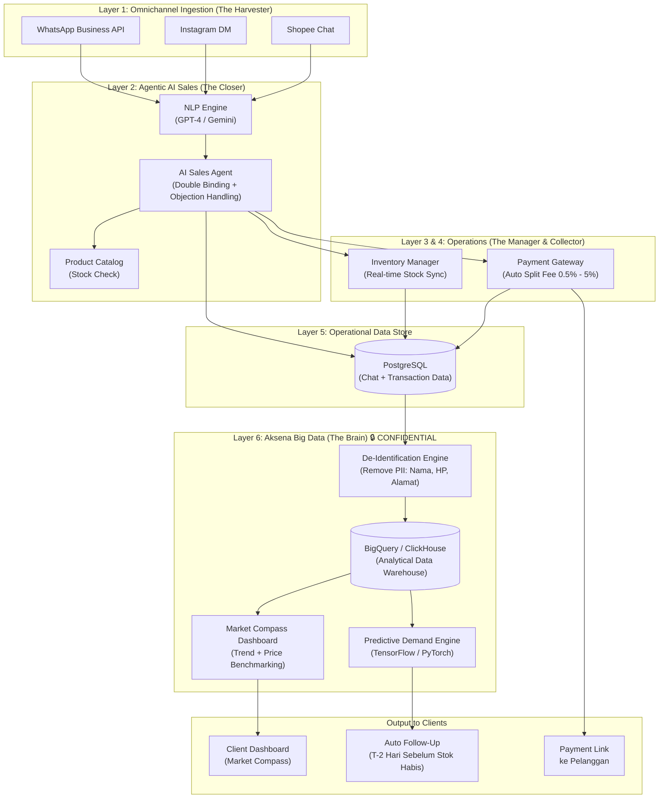

# Technical Architecture Diagram – Aksena.id v2.0

Data flow diagram: dari percakapan pelanggan hingga Big Data Dashboard.

---

## High-Level Data Flow

---

## Component Breakdown

| Component                   | Tech                          | Layer               |
|-----------------------------|-------------------------------|---------------------|
| WhatsApp / IG / Shopee      | Official APIs / Webhooks      | Ingestion           |
| NLP Engine                  | GPT-4 / Gemini API            | AI Core             |
| AI Sales Agent              | LLM + Custom Prompt           | AI Core             |
| Product Catalog             | PostgreSQL                    | AI Core             |
| Payment Gateway             | Midtrans / Xendit             | Operations          |
| Inventory Manager           | Custom Service + PostgreSQL   | Operations          |
| Operational DB              | PostgreSQL                    | Data Store          |
| De-Identification Engine    | Custom Python Service 🔒      | Big Data            |
| Analytical Warehouse        | BigQuery / ClickHouse         | Big Data            |
| Predictive Engine           | TensorFlow / PyTorch          | Big Data            |
| Market Compass              | React Dashboard               | Client-Facing       |

---

## Data Privacy Compliance

Seluruh data disimpan di **server lokal Indonesia** sesuai **UU PDP No. 27/2022**.  
PII dihapus oleh **De-Identification Engine** sebelum masuk ke Data Warehouse.
